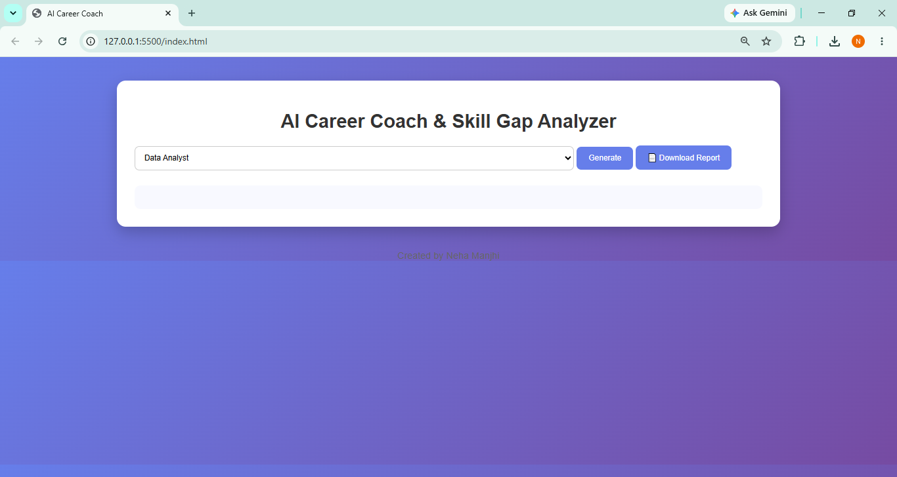
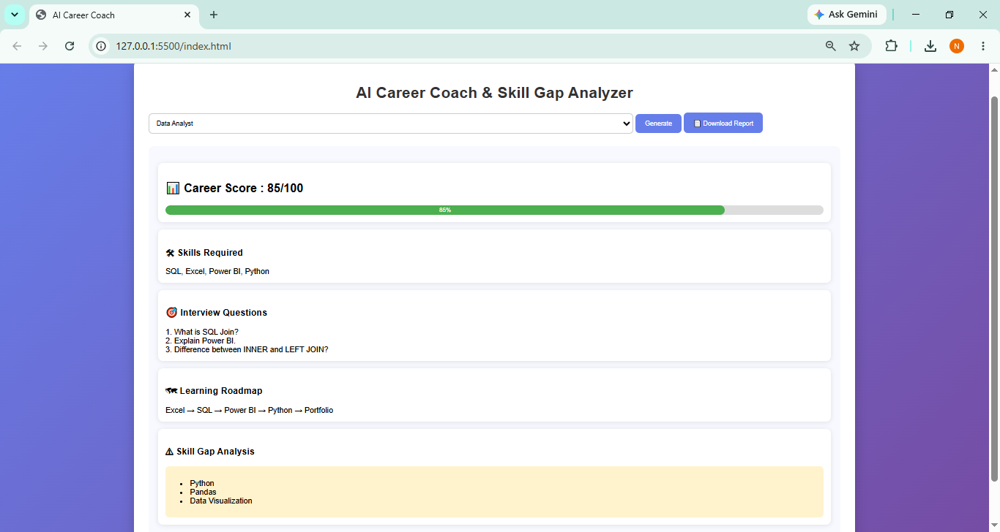

# AI Career Coach & Skill Gap Analyzer

## Overview

AI Career Coach & Skill Gap Analyzer is a web-based application that helps students and job seekers identify the skills required for different career paths.

The application provides:

* Career Score Analysis
* Skill Gap Identification
* Interview Preparation Questions
* Learning Roadmap
* Downloadable Career Report

## Supported Roles

* Data Analyst
* Business Analyst
* Web Developer
* Data Scientist

## Technologies Used

* HTML5
* CSS3
* JavaScript
* GitHub Copilot

## Features

### Career Score

Displays a role-specific career readiness score.

### Skill Gap Analysis

Identifies important skills that need improvement.

### Interview Preparation

Provides commonly asked interview questions.

### Learning Roadmap

Shows a recommended learning path.

### Download Report

Allows users to download their personalized career report.

## Future Enhancements

* AI API Integration
* PDF Report Generation
* Resume Analysis
* Job Recommendation System

## Screenshots

### Home Page

### Data Analyst Career Report

### Business Analyst Career Report

  

## Author

Neha Manjhi
